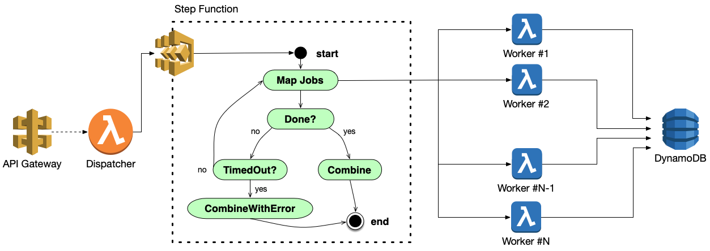

# Burst Compute Framework

[](https://zenodo.org/badge/latestdoi/301732359)
[](https://circleci.com/gh/JaneliaSciComp/burst-compute)

Serverless burst-compute implementation for AWS, using only native AWS services.

As seen in the [AWS Architecture Blog](https://aws.amazon.com/blogs/architecture/scaling-neuroscience-research-on-aws/).

For [embarassingly parallel](https://en.wikipedia.org/wiki/Embarrassingly_parallel) workloads, **N** items may be trivially processed by **T** threads. Given **N** items, and a **batchSize** (the maximum number of items to be processed by a single process in serial), we divide the work into **N/batchSize** batches and invoke that many user-provided **worker** Lambdas. When all the worker functions are done, the results are combined by the user-provided **combiner** Lambda. 

In the diagram below, the code you write is indicated by the blue lambda icons.



Here's how it works, step-by-step:
1) You define a **worker** function and a **combiner** function
2) Launch your burst compute job by calling the **dispatch** function with a range of items to process
3) The dispatcher will start copies of itself recursively and efficiently start your worker lambdas
4) Each **worker** is given a range of inputs and must compute results for those inputs and write results to DynamoDB
5) The Step Function monitors all the results and calls the combiner function when all workers are done
6) The **combiner** function reads all output from DynamoDB and aggregates them into the final result

## Build

You need Node.js 12.x or later in your path, then:

```bash
npm install
```

## Deployment

Follow the build instructions above before attempting to deploy.

Deployment will create all the necessary AWS services, including Lambda functions, DynamoDB tables, and Step Functions. To deploy this framework to your AWS account, you must have the [AWS CLI configured](https://www.serverless.com/framework/docs/providers/aws/guide/credentials#sign-up-for-an-aws-account). 

To deploy to the *dev* stage:
```bash
npm run sls -- deploy
```

This will create a application stack named `burst-compute-dev`. 

To deploy to a different stage (e.g. "prod"), add a stage argument:
```bash
npm run sls -- deploy -s prod
```

## Usage

1. Create **worker** and **combiner** functions which follow the input/output specification defined in the [Interfaces](docs/Interfaces.md) document.
2. Invoke the **dispatch** function to start a burst job. 
